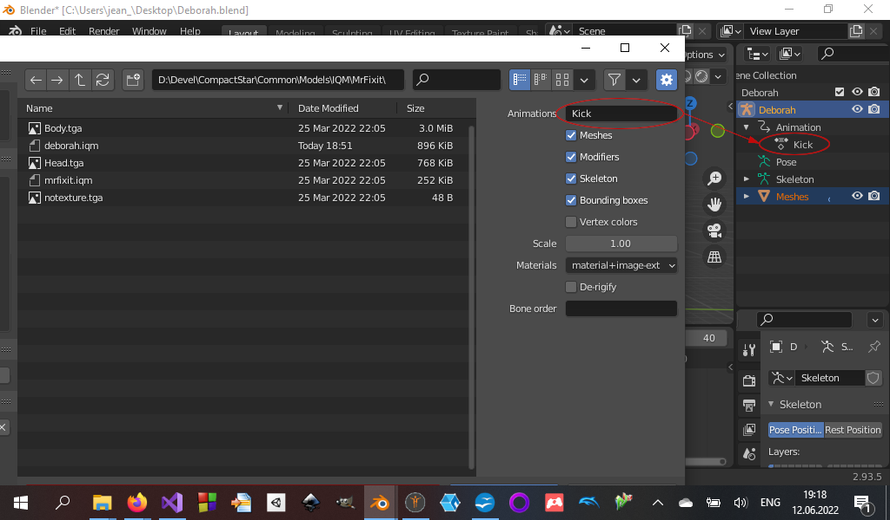

# IQM demo
This project is a small Inter-Quake Model (.iqm) reader written in c++.

## How to easily create animated characters
Below is a very simple method to create high quality animated characters which may be loaded with the provided reader.

### Prerequisites
You will need the following applications, all of them are free and may be downloaded from their official website:
- [Makehuman](http://www.makehumancommunity.org/)
- [Blender](https://www.blender.org/)
- The [Inter-Quake Model](https://github.com/lsalzman/iqm) exporter for Blender
- [HxD Editor](https://mh-nexus.de/en/hxd/)

An account to the [Adobe Mixamo](https://www.mixamo.com/) website is also required, you can create one for free if you still don't have one.

### Create the character with Makehuman
The first step is to create a character with Makehuman. The application provides a very large range of parameters allowing to create a huge variety of human characters, and in addition, the application provides a large library of clothes, topologies, and accessories, created and shared by other users.

To create a character exportable as an .iqm model, you will need to:
- Under the *Geometries=>Topologies* tab, select the **Proxy741** proxy, or any available low polygon proxy. Don't use a proxy containing too many polygons, otherwise the export to .iqm file may fail later.
- Configure your model as desired.
- Under the *Pose/Animate=>Skeleton* tab, select the **Game Engine** skeleton.
- Once ready, under the *Files=>Export* tab, select the **Filmbox (fbx)** mesh format. Ensure that the **Feet on ground** and **Binary FBX** options are checked, then select a name and click on the **Export** button.

### Animate with Mixamo
The second step is to animate your character with Mixamo. The website provides a very large range of ready-to-use realistic animations, you just need to select which you want and to configure it.

To animate your model, you will need to:
- Once logged, click on the *Upload Character* button, and select the model you exported from MakeHuman. Check if the model is well animated on the import end.
- Select the animation you want.
- Check the **In place** checkbox, and configure your animation.
- Click on the *Download* button, and select **FBX Binary (.fbx)** and **With skin** options. Click again on the *Download* button.

### Convert to .iqm with Blender
The third step is to convert the animated .fbx model to .iqm with Blender.

To do that, you will need to:
- Create a new scene and clean it completely.
- Click on *File=>Import=>FBX (.fbx)* and select the animated model you exported from Mixamo.
- Select the *Animation view* (Ctrl+PgUp/Dn) and correct the animation length.
- Play the animation to check if all is working well.
- On the right panel tree, expand the *Game Engine=>Animation* items, and rename the **Game_engine|mixamo.com|Layer0** item to a name describing your animation.
- Optionally you may also rename the **Game Engine** item to your model name.
- Select Object Mode and select your whole model (press the A key).
- Click on *File=>Export=>Inter-Quake Model (.iqm, .iqe)*. In the *Animation* edit, enter the animation name you set on the tree item.

- Ensure that all the checkboxes are checked, except the **Vertex Colors** one. Under *Materials*, select **Image**.
- Click on the *Export IQM* button.

...and voila!

**NOTE** in order to be opened with the c++ reader, you'll need to copy the textures exported by Makehuman next to the .iqm model. You'll have also to convert the image to Targa (.tga) format and to change the png to tga format in the .iqm file by using an hex editor like e.g. HxD.